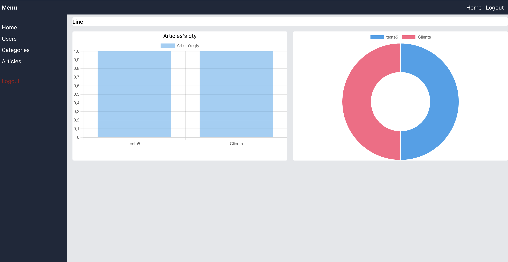

<h1>Admin System JS</h1>
<h2>CMS - content's management</h2>

Project to create my own CMS to manager content of websites developed in JS or PHP. 

This project use Node.js in the Backend and React.js in FrontEnd

<h4>#some project's dependencies:<h4>
<h5>Backend</h5>
    <ul>
        <li>Bcrypt: to create a hash and save in database</li>
        <li>Cors: To manager better the security of the server</li>
        <li>DotEnv: To create a local variables and improve the system's perfomance</li>
        <li>Express: To manager server</li>
        <li>Mysql2: To create, acess and manager the Mysql database</li>
        <li>Nodemon: to help me in create the system without necessity of close and open server everytime</li>
    </ul>
  
<h5>FrontEnd</h5>
    <ul>
        <li>"axios": to do requisitions to backend</li>
        <li>"dotenv": To create a local variables and improve the system's perfomance</li>
        <li>"react": To use React hooks and other native functions</li>
        <li>"react-router-dom": To use routes, links and other functions within this dep.</li>
        <li>"react-chartjs-2" : To create chart's visualization in home page</li>
        <li>"react-dropzone": to help me in do file upload in articles</li>
        <li>"react-toastify": to create default way to messages</li>
    </ul>
    

After the creation od this system, you can cosume the database in your own website. 

    
    

This project is in process of the build and update...